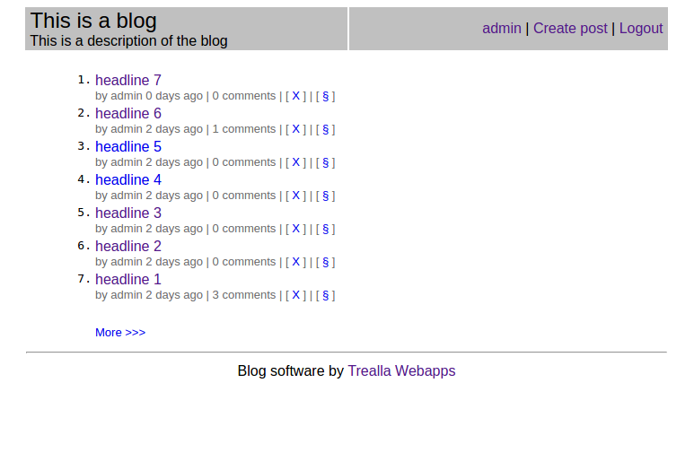
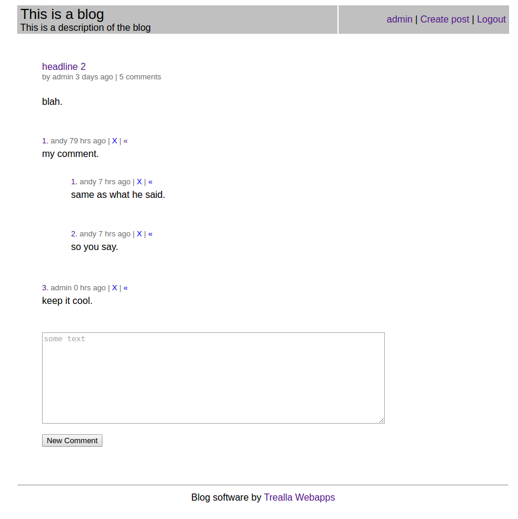

Trealla Webapps
===============

A series of web-applications that demonstrate a number of concepts
involved in using Trealla Prolog for server development. It is also
used as a proving ground for determining what features need adding.

Usage
-----

Web applications are downloaded and installed by the *tpl*
program:

	./tpl appget NAME && cd NAME

where *NAME* is the app name. It is then invoked on ports 8080 and 8443:

	./tpl --testapp

or on ports 80 and 443:

	./tpl --startapp

There are sample config files included. Just copy from:

	app.conf.SAMPLE    ->   app.conf
	web.conf.SAMPLE    ->   web.conf

and edit to suit. The *.conf* files will not be over-written by a fresh
*appget* whereas source-code files will. The files come from the
*master* branch of the GitHub repos.

Periodically you may need to *appget* to get new features.

SSL Certificates
----------------

Dummy *key.pem* and *cert.pem* files are included that are usable for
basic testing. But you will soon want to replace them with real ones
for public access. Delete them and refer to the following:

Included with each app are three scripts for obtaining and renewing free
SSL key and domain certificates from LetsEncrypt:

	letsencrypt-standalone.sh
	letsencrypt-webroot.sh

Choose either the standalone or webroot method. Then periocally run:

	letsencrypt-renew.sh

perhaps by Cron job.

Certificates - Standalone method
--------------------------------

Assumes no web-server is running.

Edit the *letsencrypt-standalone.sh* script and change *DOMAIN* to
the domain you want.

Certificates - Webroot method
-----------------------------

Assumes a web-server is running and you have access to the WWW root
directory for it.

Edit the *letsencrypt-webroot.sh* script and change *DOMAIN* to the
domain you want.

Certificates - Continued
------------------------

In the app directory, run the selected script to obtain the key and
domain certificates (note: this can take a while as many software
packages may need to be downloaded, compiled and installed), then link
your *key.pem* and *cert.pem* to the files produced...

	ln -s /etc/letsencrypt/live/DOMAIN/privkey.pem key.pem
	ln -s /etc/letsencrypt/live/DOMAIN/fullchain.pem cert.pem

This script need only be run once.

Certificates - Renewal
----------------------

The script, *letsencrypt-renew.sh* needs to be run periodically to refresh
the certificates (they are only valid for 3 months).

App - members
-------------

Demonstrates signup/login/logout and authorized access to a restricted
members-only area.

First, get the app:

	./tpl appget members && cd members

Then to run a test server on ports 8080/8443:

	./tpl --test --preload app

and point your browser at http://localhost:8080

To run a default web-server on ports 80/443:

	sudo ./tpl --start --preload app

point your browser at http://localhost

To link an accessible domain to enable public access:

	ln -s localhost YOUR-DOMAIN
	ln -s localhost www.YOUR-DOMAIN

App - blog
----------

Similar to *members* but allows unauthorized access to all of the
site. Logged in users will get extra functionality. Admin even more.

Get the app:

	./tpl appget blog && cd blog

and run as above for *members*.

Signup a blog admin account 'admin@YOUR-DOMAIN' to create posts (see
note below about *AdminPass* setting). The hostname will also be the
blog name and how you access the site.

For example, if the blog is to be at 'http://myblog.example.com' then
create the signup 'admin@myblog.example.com'. Multiple blogs may thus
be hosted by each having a unique (virtual) domain. Commenter signups
will work across all hosted blogs.

Adds optional email-verify step to account creation.

Controlled on the server side with dynamically generated content.

So far supports signup, login/logout, password-change, nick-change and
posting by the admin.

Can lock/unlock/delete/undelete posts by the owner or admin. Locked
posts don't accept any more comments. Logged-in users can post comments.
Can delete a comment if the commenter, post owner or admin. Reply to
allows threaded comments.

Deleting posts/comments just marks them as deleted (not to be shown
to other users). In other words they are physically kept as an
audit trail.

Posts can contain HTML code. Comments are plain text for now.

Before creating the admin signup, please edit and set the *AdminPass*
field in the *app.conf* config file (copied from *app.conf.SAMPLE*).

To-do:

	-users can edit their own comments
	-owners/admin can edit their own posts (including any comments)
	-admin delegate to super-users who own the posts they create
	-what about markup in comments?
	-what about replication? Tail the .kvs files?
	-password reset

